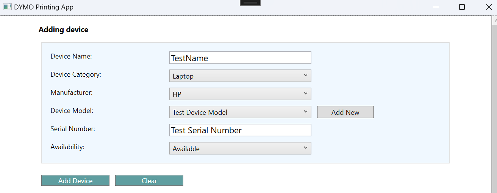
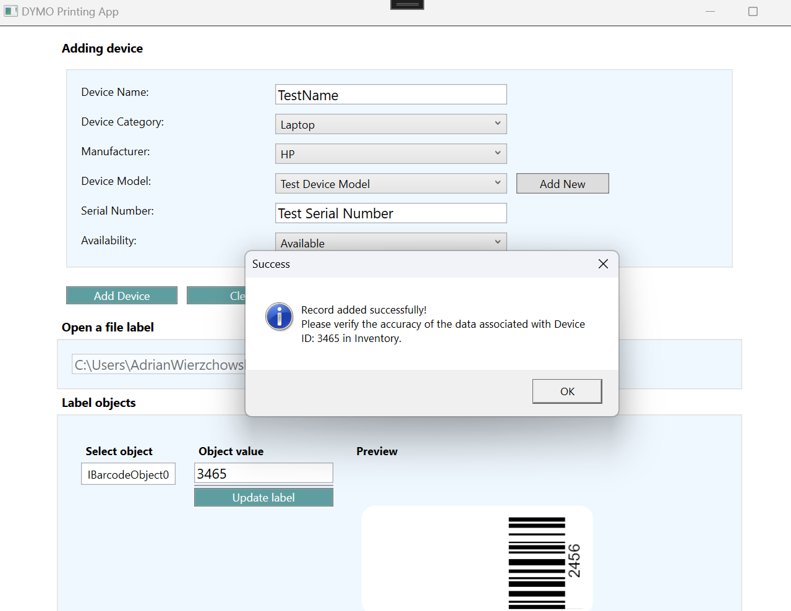
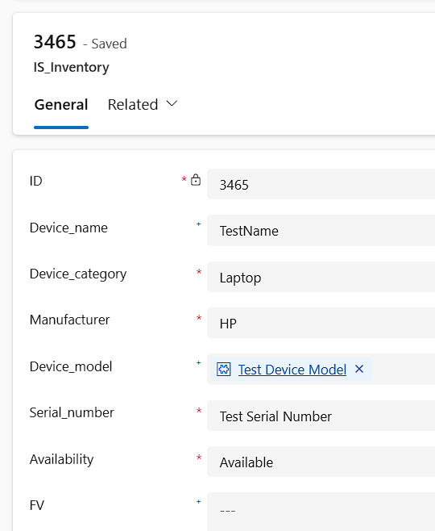
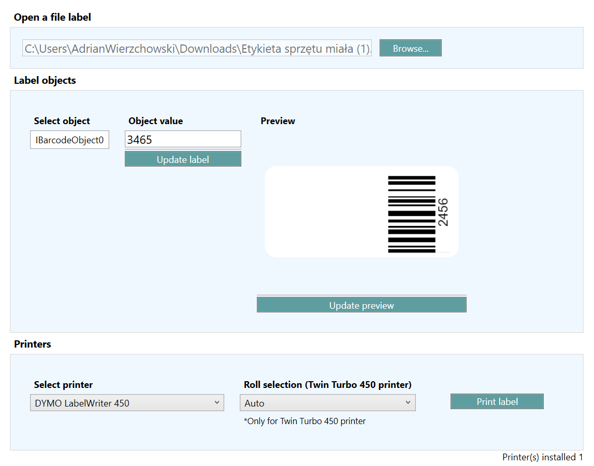

# AddnPrintHD

**AddnPrintHD** is a desktop application built with **.NET Framework 4.8** that streamlines the process of inventorying new hardware in the workplace. It provides an all-in-one solution for:

- Adding new equipment records to a **Microsoft Dynamics 365** inventory system.
- Printing physical labels for the new equipment using **DYMO** label printers.

This tool helps ensure that each new device is both digitally registered and physically labeled on the spot — with no need to switch between separate systems or tools.

> ⚙️ **This project was developed on my own initiative to improve daily operations in my current company.** The goal was to create a lightweight, yet effective internal solution for managing new hardware assets more efficiently.

---

## 🚀 Features

- Add new records to Microsoft Dynamics 365 (`cra87_is_inventories` entity).
- Support for lookups and option sets (device category, manufacturer, availability).
- Full integration with DYMO label printers via DYMO SDK.
- Print custom labels for newly added items.
- Live label preview before printing.
- Simple and intuitive desktop UI built with WPF.

---

## 🧱 Tech Stack

- **.NET Framework 4.8** (used due to DYMO SDK compatibility requirements)
- **WPF** for the user interface
- **Microsoft Dynamics Web API**
- **DYMO Connect SDK**
- **MSAL.NET** for authentication (OAuth2)
- **Newtonsoft.Json** and **System.Text.Json** for serialization

> ℹ️ DYMO SDK currently supports only .NET Framework — that's why this project targets **.NET 4.8** specifically.

---
## 🖼️ Screenshots

### 📋 Device Entry Form


### ✅ Confirmation After Adding Device


### 🧾 Record in Dynamics 365


### 🖨️ Label Printing Screen


## 🛠️ Setup

### Clone the repository

```bash
git clone https://github.com/yourusername/AddnPrintHD.git
cd AddnPrintHD
## 🛠️ Open the project

Open the `AddnPrintHD.sln` file in **Visual Studio**.

---

## 📦 Restore NuGet packages

```bash
nuget restore AddnPrintHD.sln
```

---

## ▶️ Run the application

In Visual Studio, press **F5** or click **Start**.

---

## 💡 Usage

### ➕ Add a new inventory record

- Fill in the device information in the form.
- Select the category, manufacturer, availability, and model.
- Click **"Add Device"** to submit the data to Dynamics 365.

### 🖨️ Print a label

- Select a connected **DYMO** printer.
- Choose a label template file.
- Preview the label (optional).
- Click **"Print Label"**.

---

## ⚙️ Configuration

### 🔐 Dynamics 365

- Make sure the `TokenService` is configured with your **tenant** and **client ID**.
- The app uses **MSAL.NET** to acquire an access token interactively or silently when cached.

### 🖨️ DYMO Printer

- Install the **DYMO Connect SDK**.
- Ensure your DYMO printer is recognized by the system and available for use.

---

## 🧩 Troubleshooting

### ❌ Authentication issues with Dynamics 365

- Verify tenant and client ID in `TokenService.cs`.
- Make sure user credentials are valid.

### ❌ DYMO printer not detected

- Ensure printer drivers and DYMO SDK are installed.
- Use the `LoadPrinters()` method to list available printers.

### ❌ Nothing prints

- Make sure the printer has label rolls loaded and is powered on.
- Try restarting the **DYMO service** or your **PC** if needed.

---

## 🤝 Contributing

Feel free to **fork** the repo and submit **issues** or **pull requests**.  
Suggestions and improvements are very welcome!

---

## 📄 License

This project is licensed under the **MIT License** – see the [LICENSE](LICENSE) file for details.

---

## 🙌 Acknowledgments

- **DYMO SDK** – for label printing integration  
- **Microsoft Dynamics 365** – for managing inventory data
